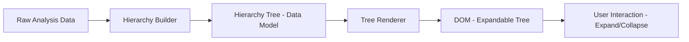
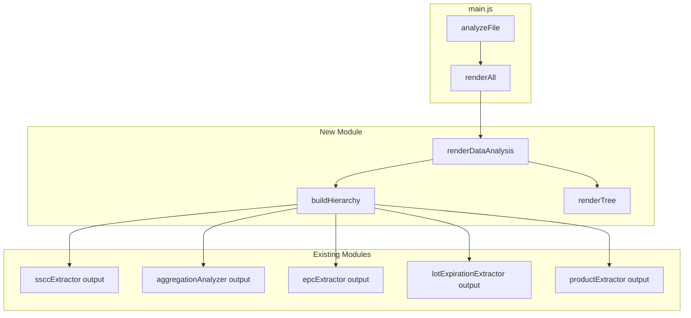

# Design Document: Data Analysis Explorer

## Overview

The Data Analysis Explorer replaces the existing "SSCC Analysis" flat table with a hierarchical tree-view component that visualizes packaging relationships: SSCC → Parent Case Serial → Child Serial Number. The explorer derives its data entirely from existing extraction modules (`ssccExtractor`, `aggregationAnalyzer`, `epcExtractor`, `productExtractor`, `lotExpirationExtractor`) and presents a clean, event-free view focused on structure, product metadata, and validation status.

The component is implemented as a new `dataAnalysisExplorer.js` module that builds an intermediate hierarchy data structure from raw analysis results, then renders it as an expandable tree using vanilla DOM manipulation consistent with the existing `uiRenderer.js` patterns.

## Architecture

The explorer follows a three-phase pipeline:



### Phase 1: Hierarchy Building (`buildHierarchy`)
Consumes outputs from `ssccExtractor`, `aggregationAnalyzer`, `epcExtractor`, and `lotExpirationExtractor` to produce a normalized tree of `HierarchyNode` objects.

### Phase 2: Metadata Resolution (`resolveMetadata`)
Enriches each node with Product Name, GTIN, Lot, and validation status by querying the `epcMap`, master data, and commissioning events.

### Phase 3: Tree Rendering (`renderDataAnalysis`)
Produces DOM elements using collapsible row patterns. Each row displays inline metadata columns. Expand/collapse is handled via click listeners on toggle icons.

### Integration with Existing Architecture

The explorer integrates at the same point where `renderSSCCTable` is currently called in `main.js`. The new `renderDataAnalysis(analysisResults)` function replaces `renderSSCCTable(ssccs)` and renders into the HTML element that currently hosts the "SSCC Analysis" collapsible section.



## Components and Interfaces

### Module: `dataAnalysisExplorer.js`

This is the sole new module. It exports two public functions:

```typescript
/**
 * Build the packaging hierarchy from analysis results.
 * Pure function, no DOM access.
 */
export function buildHierarchy(params: {
  ssccs: SSCCInfo[];
  aggregation: AggregationResult;
  epcMap: EPCMap;
  doc: ParsedDocument;
  products: ProductInfo[];
  lotExpData: LotExpData;
}): HierarchyNode[];

/**
 * Render the Data Analysis explorer into the DOM.
 * Calls buildHierarchy internally and produces the tree UI.
 */
export function renderDataAnalysis(analysisResults: AnalysisResults): void;
```

### Interface: `HierarchyNode`

```typescript
interface HierarchyNode {
  /** The EPC URI or SSCC URI identifying this node */
  id: string;
  /** 'sscc' | 'case' | 'serial' */
  level: 'sscc' | 'case' | 'serial';
  /** Resolved product name(s), comma-separated if multiple */
  productName: string;
  /** Resolved GTIN(s), comma-separated if multiple */
  gtin: string;
  /** Resolved lot number(s), comma-separated if multiple */
  lot: string;
  /** 'Yes' | 'No' | 'N/A' */
  childrenCommissioned: string;
  /** Total count of leaf serials under this node (recursive for SSCC, direct for case, 0 for serial) */
  aggregatedSerials: number;
  /** 'pass' | 'fail' */
  validationStatus: 'pass' | 'fail';
  /** Reason for validation failure, empty if passing */
  validationReason: string;
  /** Ordered child nodes */
  children: HierarchyNode[];
}
```

### Interface: `BuildHierarchyParams`

The `buildHierarchy` function receives all the data it needs via a single params object derived from `analysisResults`:

| Param | Source | Purpose |
|-------|--------|---------|
| `ssccs` | `ssccExtractor.extractSSCCs(doc)` | Identifies SSCC-level top nodes and their childEPCs |
| `aggregation` | `aggregationAnalyzer.analyzeCases(doc, epcMap)` | Provides case→child serial relationships and commissioned status |
| `epcMap` | `epcExtractor.extractAll(events)` | Maps URIs to parsed components (GTIN, serial, check digit validation) |
| `doc` | `xmlParser.parse(text)` | Provides events array and master data for metadata resolution |
| `products` | `productExtractor.extractProducts(doc, epcMap)` | Maps GTIN to product name |
| `lotExpData` | `lotExpirationExtractor.extractLotExpiration(doc, epcMap)` | Maps GTIN to lot numbers |

## Data Models

### Hierarchy Construction Algorithm

The hierarchy is built bottom-up then assembled top-down:

#### Step 1: Index Cases by ParentID

From `aggregation.cases`, build a Map: `parentEPC → CaseInfo`. Each `CaseInfo` contains `childEPCs[]`, `childrenCommissioned`, and `eventTime`.

#### Step 2: Identify Case-Level vs Serial-Level Children of SSCCs

For each SSCC in `ssccs[]`:
1. Iterate `sscc.childEPCs` (the children directly aggregated under this SSCC from AggregationEvent ADD)
2. For each childEPC:
   - If the childEPC appears as a key in the cases Map (i.e., it is itself a parentID in another AggregationEvent ADD), classify it as a **Parent Case Serial** (level 2)
   - Otherwise, classify it as a **direct serial** under the SSCC (level 2, fallback per Requirement 3.3)

#### Step 3: Build Child Serial Nodes (Level 3)

For each Parent Case Serial identified in Step 2:
- Look up `casesMap.get(caseEPC).childEPCs`
- Create a `HierarchyNode` with `level: 'serial'` for each child

#### Step 4: Build Parent Case Nodes (Level 2)

For each Parent Case Serial:
- Create a `HierarchyNode` with `level: 'case'`
- Attach child serial nodes from Step 3
- Compute `aggregatedSerials = children.length`

#### Step 5: Build SSCC Nodes (Level 1)

For each SSCC:
- Create a `HierarchyNode` with `level: 'sscc'`
- Attach case nodes (and any direct serial nodes for fallback)
- Compute `aggregatedSerials` = sum of all nested leaf serials (recursive)

#### Step 6: Fallback (No SSCCs)

Per Requirement 3:
- If `ssccs.length === 0` and cases exist → promote cases to top-level
- If `ssccs.length === 0` and no cases → list orphaned/commissioned serials as top-level "loose units"
- If nothing exists → return empty array (triggers empty state message)

#### Step 7: Sort

Sort nodes at each level alphabetically by `id` (the EPC URI).

### Metadata Resolution

For each node, metadata is resolved as follows:

| Field | SSCC Node | Case Node | Serial Node |
|-------|-----------|-----------|-------------|
| **GTIN** | Union of GTINs from all descendant serials | Union of GTINs from direct children | Parsed from own SGTIN URI via `epcMap.all.get(id).gtin` |
| **Product Name** | Lookup each resolved GTIN in `products[]` by matching `product.gtin`, use `product.productName` | Same as SSCC | Same, single value |
| **Lot** | Union of lot numbers from `lotExpData.lotsByProduct[gtin]` for each resolved GTIN | Same as SSCC | Lot from commissioning ILMD for this serial's GTIN |
| **Children Commissioned** | Computed from aggregation data for this SSCC's direct case children | From `aggregation.cases[].childrenCommissioned` for this case | "N/A" |
| **Aggregated Serials** | Recursive count of all leaf serial nodes | Direct child count | 0 |

When multiple GTINs or lots exist, values are joined with ", ".

### Validation Status Computation

Each node's validation status is computed per Requirement 8:

| Condition | Result |
|-----------|--------|
| **SSCC Node**: `isValidSSCC(sscc18)` returns false | `fail` — "Invalid SSCC check digit" |
| **SSCC Node**: has zero children (no cases, no direct serials) | `fail` — "Empty SSCC (no aggregated content)" |
| **Case Node**: `isValidGTIN(gtin14)` of derived GTIN returns false | `fail` — "Invalid GTIN check digit" |
| **Case Node**: has zero children | `fail` — "Empty case (no child serials)" |
| **Case Node**: one or more childEPCs not found in any AggregationEvent | `fail` — "Missing aggregation reference" |
| **Serial Node**: `isValidGTIN(gtin14)` of derived GTIN returns false | `fail` — "Invalid GTIN check digit" |
| All checks pass | `pass` |

The validation uses `isValidSSCC` and `isValidGTIN` already exported from `epcExtractor.js`.

### Rendering Data Model (DOM Structure)

Each hierarchy row is rendered as:

```html
<div class="hierarchy-row" data-level="sscc|case|serial" data-id="{epc-uri}">
  <span class="hierarchy-toggle" aria-expanded="false" aria-label="Expand">▶</span>
  <span class="hierarchy-id text-mono">{truncated URI}</span>
  <span class="hierarchy-field">{productName}</span>
  <span class="hierarchy-field">{lot}</span>
  <span class="hierarchy-field">{gtin}</span>
  <span class="hierarchy-field">{childrenCommissioned}</span>
  <span class="hierarchy-field">{aggregatedSerials}</span>
  <span class="hierarchy-validation {pass|fail}" aria-label="Validation: {status}">
    {icon}
  </span>
</div>
<div class="hierarchy-children" hidden>
  <!-- child rows, indented -->
</div>
```

- Leaf nodes (`serial` with no children) omit the toggle element.
- Indentation is achieved with `padding-left` scaled by depth level (e.g., 20px per level).
- Validation icons: ✓ (green, pass) and ✗ (red, fail) — supplemented by icon shape difference for accessibility (checkmark vs X).

### Expand/Collapse Behavior

- All nodes start collapsed (`aria-expanded="false"`, children container `hidden`).
- Clicking a toggle: sets `aria-expanded="true"`, removes `hidden` from children container, rotates icon.
- Collapsing: sets `aria-expanded="false"`, adds `hidden`, but preserves internal child states (per Requirement 4.5).
- Event delegation on the tree container handles all toggle clicks.


## Correctness Properties

*A property is a characteristic or behavior that should hold true across all valid executions of a system—essentially, a formal statement about what the system should do. Properties serve as the bridge between human-readable specifications and machine-verifiable correctness guarantees.*

### Property 1: Hierarchy structure reflects aggregation relationships

*For any* set of SSCC identifiers with their AggregationEvent ADD child EPCs, and any set of case-level AggregationEvent ADD relationships, the hierarchy produced by `buildHierarchy` SHALL contain every SSCC as a top-level node, every case serial as a child of its aggregating SSCC, and every item serial as a child of its aggregating case—with no relationships derived from DELETE or OBSERVE actions.

**Validates: Requirements 2.1, 2.2, 2.3, 2.4, 2.5, 2.6**

### Property 2: Alphabetical sort invariant

*For any* hierarchy produced by `buildHierarchy`, at every level (top-level, children of any node, children of children), the nodes SHALL be sorted in ascending alphabetical order by their `id` (EPC URI).

**Validates: Requirements 2.7**

### Property 3: Fallback to cases when no SSCCs present

*For any* set of analysis results where `ssccs` is empty but `aggregation.cases` is non-empty, `buildHierarchy` SHALL produce a hierarchy where the top-level nodes are Parent Case Serials, not SSCCs.

**Validates: Requirements 3.1**

### Property 4: Fallback to loose serials when no SSCCs and no cases

*For any* set of analysis results where `ssccs` is empty and `aggregation.cases` has no entries with children, `buildHierarchy` SHALL produce a hierarchy where the top-level nodes are the loose serial numbers (commissioned but unaggregated EPCs).

**Validates: Requirements 3.2**

### Property 5: Direct serials under SSCC when no intermediate cases

*For any* SSCC that has child EPCs in its AggregationEvent ADD but none of those child EPCs are themselves parentIDs in other AggregationEvents, `buildHierarchy` SHALL place those child EPCs as second-level nodes directly under the SSCC.

**Validates: Requirements 3.3**

### Property 6: Empty SSCCs are leaf nodes with zero aggregated serials

*For any* SSCC that has no child EPCs from any AggregationEvent ADD, `buildHierarchy` SHALL produce a node with `children = []` and `aggregatedSerials = 0`.

**Validates: Requirements 3.5**

### Property 7: Toggle expand/collapse round-trip preserves child state

*For any* hierarchy node that is expanded (revealing children where some children are also expanded), collapsing that node and then re-expanding it SHALL restore all children to their previously expanded or collapsed states.

**Validates: Requirements 4.2, 4.3, 4.5**

### Property 8: Leaf nodes have no toggle

*For any* hierarchy node with `children.length === 0`, the rendered output SHALL NOT include an expand/collapse toggle element for that node.

**Validates: Requirements 4.4**

### Property 9: Aggregated serials count invariant

*For any* SSCC node, `aggregatedSerials` SHALL equal the total count of all leaf serial descendants (recursive). *For any* case node, `aggregatedSerials` SHALL equal the count of its direct children. *For any* serial (leaf) node, `aggregatedSerials` SHALL equal 0.

**Validates: Requirements 5.4, 5.5, 5.6**

### Property 10: Multi-value metadata fields display all distinct values

*For any* hierarchy node whose descendant serials have N distinct GTINs or M distinct lot numbers (where N > 1 or M > 1), the node's `gtin` field SHALL contain all N GTINs separated by commas, and the `lot` field SHALL contain all M lot numbers separated by commas.

**Validates: Requirements 5.7, 6.5, 6.6**

### Property 11: GTIN resolution from SGTIN URIs

*For any* hierarchy node, the resolved GTIN(s) SHALL be derived by parsing the SGTIN URIs of its leaf descendants (or its own URI if it is a serial node) using the standard GS1 SGTIN parsing algorithm, yielding valid 14-digit GTINs.

**Validates: Requirements 6.1, 6.2**

### Property 12: Product name resolution via master data idpat lookup

*For any* hierarchy node with a resolved GTIN that has a corresponding master data entry keyed by the idpat pattern `urn:epc:idpat:sgtin:{companyPrefix}.{itemReference}.*`, the `productName` field SHALL equal the value found in master data attributes under description/name keys.

**Validates: Requirements 6.3**

### Property 13: Lot resolution from ILMD commissioning data

*For any* hierarchy node whose descendant serial EPCs appear in ObjectEvent ADD events with bizStep containing "commissioning" and ILMD lot data, the node's `lot` field SHALL contain those lot numbers.

**Validates: Requirements 6.4**

### Property 14: Children commissioned correctness

*For any* hierarchy node at the case or SSCC level: if all child EPCs have a commissioning event with eventTime strictly earlier than the earliest aggregation eventTime for that parent, `childrenCommissioned` SHALL be "Yes"; otherwise it SHALL be "No". *For any* serial (leaf) node, `childrenCommissioned` SHALL be "N/A". *For any* node with zero children, `childrenCommissioned` SHALL be "No".

**Validates: Requirements 7.1, 7.2, 7.3, 7.4, 7.5**

### Property 15: Validation status computation correctness

*For any* hierarchy node: validation SHALL pass if and only if the node's identifier has a valid GS1 check digit (SSCC-18 for SSCC nodes, GTIN-14 for case/serial nodes) AND (for parent nodes) the node has at least one child AND all child EPCs are present in aggregation relationships. Otherwise, validation SHALL fail.

**Validates: Requirements 8.1, 8.2, 8.4**

### Property 16: No event information in rendered output

*For any* rendered hierarchy, the output SHALL NOT contain event type labels, event timestamps, bizStep values, disposition values, readPoint values, bizLocation values, action values, source/destination lists, business transaction lists, event IDs, or event role labels (parentID, childEPC, epcList) as visible text.

**Validates: Requirements 5.2, 5.3, 9.1, 9.2, 9.3**

## Error Handling

### Input Validation

| Condition | Handling |
|-----------|----------|
| `analysisResults` is null/undefined | `renderDataAnalysis` returns immediately; no DOM changes |
| `ssccs` array is empty | Fallback logic triggers (Requirements 3.1–3.4) |
| `aggregation` is null | Treat as empty cases; proceed to serial fallback |
| `epcMap` is null | Skip metadata resolution; display empty fields |
| Unparseable EPC URI | `epcMap.all.get(uri)` returns undefined; GTIN left empty |
| Master data missing for GTIN | Product name left empty; GTIN still displayed |
| No commissioning events for EPCs | Lot field left empty; Children Commissioned = "No" |
| Invalid check digit on identifier | Validation status = "fail"; node still displayed |

### Graceful Degradation

The explorer always renders something meaningful:
1. Full hierarchy when all data is present
2. Cases as top-level when SSCCs are absent
3. Loose serials when no aggregation data exists
4. Empty state message when nothing exists at all

No errors are thrown to the user. All failure conditions result in empty fields or degraded views, never broken rendering.

### DOM Safety

- All user-facing text is HTML-escaped using the existing `_escapeHtml` utility pattern from `uiRenderer.js`
- EPC URIs are truncated for display but full URIs are stored in `data-id` attributes
- Event delegation prevents memory leaks from large trees

## Testing Strategy

### Unit Tests (Example-Based)

Unit tests cover specific rendering behaviors and edge cases:

- Section heading renders as "Data Analysis"
- "SSCC Analysis" label does not appear anywhere
- Empty state message renders when no data exists
- Leaf nodes have no toggle element
- Validation icons use distinct shapes (✓ vs ✗) in addition to color
- Missing metadata fields render as empty columns (not hidden)

### Property-Based Tests (fast-check)

Property-based testing is appropriate for this feature because `buildHierarchy` is a pure function with complex input combinations (varying numbers of SSCCs, cases, serials, and metadata) where universal properties must hold regardless of input shape.

**Library:** fast-check (already available in the project as a dependency)
**Configuration:** Minimum 100 iterations per property test
**Tag format:** `Feature: data-analysis-explorer, Property {N}: {title}`

Each correctness property from the design document maps to one property-based test:

1. **Property 1** — Generate random SSCC+case+serial aggregation trees, verify hierarchy structure
2. **Property 2** — Generate random hierarchies, verify sort order at all levels
3. **Property 3** — Generate data without SSCCs but with cases, verify fallback
4. **Property 4** — Generate data without SSCCs or cases, verify serial fallback
5. **Property 5** — Generate SSCCs with direct serial children, verify placement
6. **Property 6** — Generate empty SSCCs, verify leaf + zero count
7. **Property 7** — Simulate expand/collapse cycles, verify state preservation
8. **Property 8** — Generate hierarchies with leaf nodes, verify no toggle
9. **Property 9** — Generate hierarchies, verify aggregatedSerials count formula
10. **Property 10** — Generate multi-GTIN/multi-lot scenarios, verify comma-separated output
11. **Property 11** — Generate random SGTIN URIs, verify GTIN derivation
12. **Property 12** — Generate GTINs with master data, verify product name lookup
13. **Property 13** — Generate commissioning events with ILMD, verify lot resolution
14. **Property 14** — Generate timing scenarios, verify Children Commissioned logic
15. **Property 15** — Generate valid/invalid identifiers and structures, verify validation
16. **Property 16** — Generate hierarchies, render to string, verify no event text

### Integration Tests

- Full pipeline test: load a fixture XML, run `analyzeFile`, call `renderDataAnalysis`, verify DOM structure
- Verify `renderDataAnalysis` integrates correctly with `main.js` when replacing `renderSSCCTable`
- Verify filter interactions still work with the new section

### Test Generators (for Property Tests)

Key generators needed:
- `arbSSCC()` — random valid/invalid SSCC URIs
- `arbSGTIN()` — random valid/invalid SGTIN URIs with varying company prefixes and serials
- `arbAggregationTree(depth)` — random tree of SSCC→case→serial relationships
- `arbMasterData(gtins)` — random master data entries for given GTINs
- `arbCommissioningEvents(epcs)` — random commissioning events with ILMD for given EPCs
