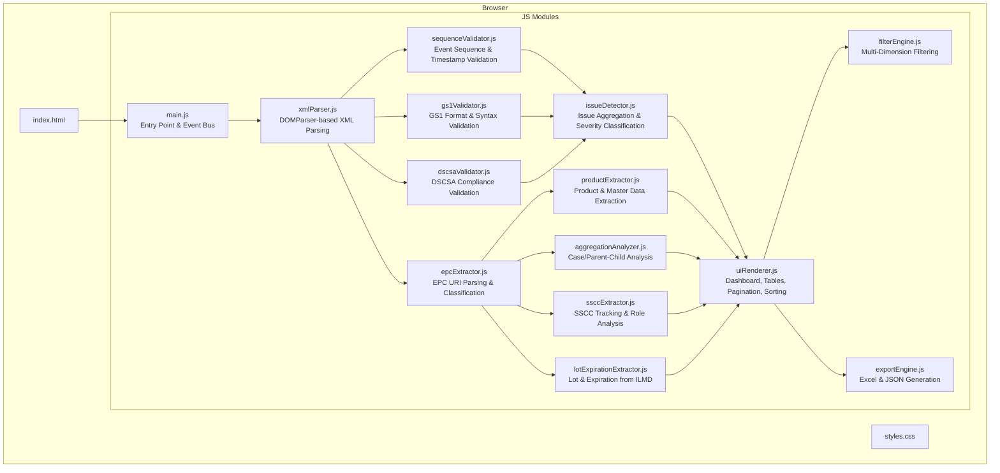
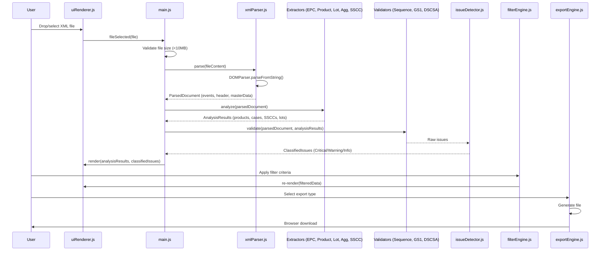

# Design Document: EPCIS File Analyzer

## Overview

The EPCIS File Analyzer is a browser-only, single-page application that parses EPCIS XML files and provides comprehensive analysis of supply chain event data. It runs entirely client-side with no backend dependencies, using browser-native `DOMParser` for XML processing and modular JavaScript for analysis, validation, and rendering.

The tool targets pharmaceutical supply chain analysts and compliance officers who need to inspect EPCIS documents for data quality, GS1 standard conformance, and DSCSA regulatory compliance. It provides:

- A **summary dashboard** with key metrics (serial counts, cases, products, SSCCs, event breakdowns)
- A **detailed event inspector** with collapsible panels per event
- **Product, case/aggregation, and SSCC analysis** tables
- **Validation** against GS1 EPCIS standards and DSCSA requirements with severity classification
- **Filtering** across 11 dimensions with AND logic
- **Export** to Excel (.xlsx) and JSON formats

### Design Decisions

1. **No build step**: The tool ships as raw HTML/CSS/JS files openable via `file://` — no bundler, transpiler, or package manager needed.
2. **ES Modules**: JavaScript uses ES module `import`/`export` syntax for modularity, loaded via `<script type="module">`.
3. **SheetJS (xlsx) via CDN with local fallback**: The only external dependency is SheetJS for Excel generation. It is loaded from CDN with a local fallback copy for offline use.
4. **DOMParser only**: No external XML libraries. The browser-native DOMParser handles all XML parsing including namespace resolution.
5. **Event-driven architecture**: A central event bus decouples modules — the parser emits data, and downstream modules subscribe to process it independently.

## Architecture



### Data Flow



### Module Responsibility Boundaries

| Module | Input | Output | Dependencies |
|--------|-------|--------|--------------|
| xmlParser.js | Raw XML string | ParsedDocument object | None (DOMParser) |
| epcExtractor.js | ParsedDocument | EPC classification map | None |
| productExtractor.js | ParsedDocument, EPC map | Product[] with metrics | epcExtractor |
| lotExpirationExtractor.js | ParsedDocument | Lot/Expiration by GTIN | None |
| aggregationAnalyzer.js | ParsedDocument, EPC map | Case[], unmatched items | epcExtractor |
| ssccExtractor.js | ParsedDocument | SSCC[] with roles/events | None |
| sequenceValidator.js | ParsedDocument | Issue[] | None |
| gs1Validator.js | ParsedDocument, EPC map | Issue[] | epcExtractor |
| dscsaValidator.js | ParsedDocument | Issue[] | None |
| issueDetector.js | Issue[] from all validators | ClassifiedIssue[] | None |
| filterEngine.js | AnalysisResults, FilterCriteria | FilteredResults | None |
| exportEngine.js | AnalysisResults or FilteredResults | File blob (xlsx/json) | SheetJS (xlsx) |
| uiRenderer.js | AnalysisResults, ClassifiedIssues | DOM mutations | None |

## Components and Interfaces

### xmlParser.js

```typescript
interface ParsedDocument {
  header: EPCISHeader | null;
  sbdh: StandardBusinessDocumentHeader | null;
  masterData: MasterDataMap;
  events: EPCISEvent[];
  parseErrors: ParseError[];
}

interface EPCISHeader {
  standardBusinessDocumentHeader: StandardBusinessDocumentHeader | null;
  masterData: MasterDataEntry[];
}

interface StandardBusinessDocumentHeader {
  sender: { identifier: string; name: string };
  receiver: { identifier: string; name: string };
}

interface MasterDataEntry {
  id: string; // vocabulary element ID (e.g., GTIN URN)
  type: string; // vocabulary type
  attributes: Record<string, string>;
}

interface EPCISEvent {
  eventType: 'ObjectEvent' | 'AggregationEvent' | 'TransactionEvent' | 'TransformationEvent' | 'AssociationEvent';
  eventTime: string; // ISO 8601
  eventTimeZoneOffset: string;
  action: 'ADD' | 'OBSERVE' | 'DELETE';
  bizStep: string | null;
  disposition: string | null;
  readPoint: string | null;
  bizLocation: string | null;
  epcList: string[];
  parentID: string | null;
  childEPCs: string[];
  quantityList: QuantityElement[];
  sourceList: SourceDest[];
  destinationList: SourceDest[];
  ilmd: ILMDData | null;
  bizTransactionList: BizTransaction[];
  eventID: string | null;
  xmlPath: string; // XPath-like location in original document
}

interface QuantityElement {
  epcClass: string;
  quantity: number;
  uom: string | null;
}

interface SourceDest {
  type: string;
  value: string;
}

interface ILMDData {
  lotNumber: string | null;
  expirationDate: string | null;
  additionalAttributes: Record<string, string>;
}

interface BizTransaction {
  type: string;
  value: string;
}

// Public API
function parse(xmlString: string): ParsedDocument;
```

### epcExtractor.js

```typescript
interface ParsedEPC {
  uri: string; // Full URI
  type: 'sgtin' | 'sscc' | 'sgln' | 'other';
  companyPrefix: string | null;
  itemReference: string | null;
  serialNumber: string | null;
  gtin: string | null; // Computed 14-digit GTIN for SGTIN
  ndc: string | null; // Derived from GTIN when applicable
}

interface EPCMap {
  all: Map<string, ParsedEPC>; // URI -> ParsedEPC
  bySGTIN: Map<string, ParsedEPC[]>; // GTIN -> ParsedEPC[]
  bySSCC: Map<string, ParsedEPC>;
  bySerial: Map<string, ParsedEPC>;
}

function extractAll(events: EPCISEvent[]): EPCMap;
function parseSGTIN(uri: string): ParsedEPC | null;
function parseSSCC(uri: string): ParsedEPC | null;
function computeGTIN(companyPrefix: string, itemReference: string): string;
```

### productExtractor.js

```typescript
interface ProductInfo {
  sgtinPattern: string; // e.g., "urn:epc:id:sgtin:0383745.038009.*"
  gtin: string; // 14-digit GTIN
  ndc: string | null;
  productName: string | null; // From master data
  serialCount: number;
  lotNumbers: string[];
  expirationDates: string[];
  caseCount: number;
  ssccCount: number;
}

function extractProducts(doc: ParsedDocument, epcMap: EPCMap): ProductInfo[];
```

### aggregationAnalyzer.js

```typescript
interface CaseInfo {
  parentEPC: string; // Full URI of parent
  childEPCs: string[]; // Full URIs
  childCount: number;
  associatedGTIN: string | null;
  aggregationStatus: 'Valid' | 'Missing';
  childrenCommissioned: 'Yes' | 'No';
  eventTime: string;
}

interface AggregationResult {
  cases: CaseInfo[];
  emptyCases: CaseInfo[]; // Cases with zero children
  orphanedSerials: string[]; // Commissioned but not aggregated
}

function analyzeCases(doc: ParsedDocument, epcMap: EPCMap): AggregationResult;
```

### ssccExtractor.js

```typescript
interface SSCCInfo {
  sscc: string; // Full URI
  eventCount: number;
  roles: SSCCRole[];
  events: SSCCEventReference[];
  childEPCs: string[]; // from aggregation events
  associatedProducts: string[]; // GTINs
}

type SSCCRole = 'parentID' | 'childEPC' | 'epcList' | 'source' | 'destination' | 'shipmentIdentifier';

interface SSCCEventReference {
  eventType: string;
  eventTime: string;
  bizStep: string | null;
  disposition: string | null;
  action: string;
  role: SSCCRole;
}

function extractSSCCs(doc: ParsedDocument): SSCCInfo[];
```

### sequenceValidator.js

```typescript
function validateSequences(doc: ParsedDocument): Issue[];
// Validates:
// - Timestamp ordering per EPC
// - Business step sequence: commission → pack → ship → receive → decommission
// - DELETE without prior ADD/OBSERVE
// - Shipping before commissioning/aggregation
// - Receiving before shipping
```

### gs1Validator.js

```typescript
function validateGS1(doc: ParsedDocument, epcMap: EPCMap): Issue[];
// Validates:
// - GTIN format (14 digits, valid check digit)
// - SSCC format (18 digits, valid check digit)
// - SGTIN URI format
// - Business step URIs (CBV vocabulary)
// - Disposition URIs (CBV vocabulary)
// - Source/destination format
// - eventTime ISO 8601 format
// - eventTimeZoneOffset format
// - Missing required fields
// - ILMD presence and completeness
// - Duplicate serial numbers and event IDs
// - Consistency checks (same serial, different GTIN/lot/exp)
// - UOM consistency per GTIN
// - Missing readPoint/bizLocation
```

### dscsaValidator.js

```typescript
function validateDSCSA(doc: ParsedDocument): Issue[];
// Validates:
// - TI completeness in shipping/receiving TransactionEvents
// - TH presence for change-of-ownership events
// - TS indicators in TransactionEvents
// - Verification data elements (GTIN, serial, lot, exp)
// - Suspect/illegitimate product handling (recalled/suspended disposition)
// - Void shipping notification data
```

### issueDetector.js

```typescript
interface Issue {
  severity: 'Critical' | 'Warning' | 'Info';
  title: string; // max 120 chars
  description: string; // max 500 chars
  affectedItem: string; // EPC URI or "N/A"
  eventTime: string | null;
  xmlPath: string;
  suggestedCorrection: string;
  category: string; // e.g., "GS1 Format", "DSCSA Compliance", "Sequence"
}

function classifyAndAggregate(rawIssues: Issue[]): Issue[];
```

### filterEngine.js

```typescript
interface FilterCriteria {
  product: string | null; // GTIN
  lotNumber: string | null;
  expirationDate: string | null;
  eventType: string | null;
  bizStep: string | null;
  disposition: string | null;
  serialNumber: string | null;
  caseSerial: string | null;
  sscc: string | null;
  issueSeverity: 'Critical' | 'Warning' | 'Info' | null;
  issueType: string | null;
  searchQuery: string | null; // substring match on serial/case/SSCC
}

interface FilteredResults {
  events: EPCISEvent[];
  products: ProductInfo[];
  cases: CaseInfo[];
  ssccs: SSCCInfo[];
  issues: Issue[];
}

function applyFilters(data: AnalysisResults, criteria: FilterCriteria): FilteredResults;
function clearFilters(): void;
```

### exportEngine.js

```typescript
type ReportType = 'full-analysis' | 'issues-only' | 'product-summary' | 'case-aggregation' | 'json-full';

function exportReport(
  type: ReportType, 
  data: AnalysisResults, 
  originalFilename: string
): void; // Triggers browser download
```

### uiRenderer.js

```typescript
function renderDashboard(data: AnalysisResults): void;
function renderEventInspector(events: EPCISEvent[]): void;
function renderProductTable(products: ProductInfo[]): void;
function renderCaseTable(cases: AggregationResult): void;
function renderSSCCTable(ssccs: SSCCInfo[]): void;
function renderIssuesTable(issues: Issue[]): void;
function renderFilters(data: AnalysisResults): void;
function renderPagination(container: HTMLElement, totalRows: number, pageSize: number, currentPage: number): void;
function sortTable(tableId: string, column: string, direction: 'asc' | 'desc'): void;
```

## Data Models

### Core Analysis Results Object

```typescript
interface AnalysisResults {
  // Parsed document
  document: ParsedDocument;
  
  // Extracted data
  epcMap: EPCMap;
  products: ProductInfo[];
  aggregation: AggregationResult;
  ssccs: SSCCInfo[];
  
  // Validation results
  issues: Issue[];
  
  // Dashboard metrics (computed)
  metrics: DashboardMetrics;
}

interface DashboardMetrics {
  totalUniqueSerials: number;
  totalCases: number;
  totalProducts: number;
  totalSSCCs: number;
  eventCountByType: Record<string, number>;
  eventCountByAction: Record<string, number>;
  uniqueBizSteps: string[];
  uniqueDispositions: string[];
  uniqueReadPoints: string[];
  uniqueBizLocations: string[];
  allGTINs: string[];
  allNDCs: string[];
  lotsByProduct: Record<string, string[]>;
  expirationsByProduct: Record<string, string[]>;
  caseSerials: string[];
  ssccIdentifiers: string[];
  sender: { name: string; identifier: string } | null;
  receiver: { name: string; identifier: string } | null;
}
```

### GS1 Check Digit Calculation

The modulo-10 algorithm for GTIN (14-digit) and SSCC (18-digit) validation:

```javascript
function calculateGS1CheckDigit(digits) {
  // digits: string of N-1 digits (13 for GTIN, 17 for SSCC)
  let sum = 0;
  const len = digits.length;
  for (let i = 0; i < len; i++) {
    const digit = parseInt(digits[i], 10);
    // Multiply alternating digits by 3 and 1, starting from rightmost
    const multiplier = (len - i) % 2 === 0 ? 1 : 3;
    sum += digit * multiplier;
  }
  return (10 - (sum % 10)) % 10;
}

function isValidGTIN(gtin) {
  if (!/^\d{14}$/.test(gtin)) return false;
  const check = calculateGS1CheckDigit(gtin.substring(0, 13));
  return check === parseInt(gtin[13], 10);
}

function isValidSSCC(sscc) {
  if (!/^\d{18}$/.test(sscc)) return false;
  const check = calculateGS1CheckDigit(sscc.substring(0, 17));
  return check === parseInt(sscc[17], 10);
}
```

### SGTIN URI Parsing

```javascript
// Format: urn:epc:id:sgtin:<CompanyPrefix>.<ItemRef>.<SerialNumber>
// CompanyPrefix + ItemRef = 13 digits total
function parseSGTINUri(uri) {
  const match = uri.match(/^urn:epc:id:sgtin:(\d+)\.(\d+)\.(.+)$/);
  if (!match) return null;
  const [, companyPrefix, itemRef, serial] = match;
  if (companyPrefix.length + itemRef.length !== 13) return null;
  
  // Compute GTIN: indicator digit (first digit of itemRef) + companyPrefix + remaining itemRef + check digit
  const indicator = itemRef[0];
  const gtinBase = indicator + companyPrefix + itemRef.substring(1);
  const checkDigit = calculateGS1CheckDigit(gtinBase);
  const gtin = gtinBase + checkDigit;
  
  return { companyPrefix, itemReference: itemRef, serialNumber: serial, gtin };
}
```

### Valid CBV Business Steps and Dispositions

```javascript
const VALID_BIZ_STEPS = [
  'commissioning', 'decommissioning', 'packing', 'unpacking',
  'shipping', 'receiving', 'accepting', 'rejecting',
  'storing', 'picking', 'loading', 'unloading',
  'inspecting', 'holding', 'destroying', 'encoding',
  'killing', 'locking', 'unlocking', 'void_shipping',
  'cycle_counting', 'arriving', 'departing', 'entering',
  'exiting', 'repairing', 'replacing', 'sampling',
  'sensor_reporting', 'transforming'
];

const VALID_DISPOSITIONS = [
  'active', 'container_closed', 'container_open',
  'damaged', 'destroyed', 'dispensed', 'disposed',
  'encoded', 'expired', 'in_progress', 'in_transit',
  'inactive', 'mismatch_epc_class', 'needs_replacement',
  'no_pedigree_match', 'non_sellable_other',
  'partially_dispensed', 'recalled', 'reserved',
  'retail_sold', 'returned', 'sellable_accessible',
  'sellable_not_accessible', 'stolen', 'suspended',
  'unavailable', 'unknown'
];
```

### Business Step Sequence for Validation

```javascript
const BIZ_STEP_ORDER = {
  'commissioning': 1,
  'packing': 2,
  'shipping': 3,
  'receiving': 4,
  'decommissioning': 5,
  'destroying': 5
};
```

### Issue Severity Classification Rules

| Condition | Severity |
|-----------|----------|
| Malformed XML (cannot parse) | Critical |
| Missing EPCISBody or EventList | Critical |
| All DSCSA compliance violations | Critical |
| Invalid GTIN/SSCC/SGTIN format | Warning |
| Missing required event fields | Warning |
| Non-sequential timestamps per EPC | Warning |
| Business step sequence violation | Warning |
| Duplicate serial/event ID | Warning |
| Missing ILMD in commissioning event | Warning |
| Inconsistent product data cross-event | Warning |
| Missing optional fields (readPoint in non-required contexts) | Info |
| Deprecated URI patterns | Info |
| Missing master data for GTIN | Info |


## Correctness Properties

*A property is a characteristic or behavior that should hold true across all valid executions of a system — essentially, a formal statement about what the system should do. Properties serve as the bridge between human-readable specifications and machine-verifiable correctness guarantees.*

### Property 1: XML Parsing Round-Trip (Event Extraction Completeness)

*For any* valid EPCIS XML document containing N events of any type (ObjectEvent, AggregationEvent, TransactionEvent, TransformationEvent, AssociationEvent), parsing the document should produce exactly N event objects, each with the correct eventType matching the XML element tag name.

**Validates: Requirements 1.7**

### Property 2: Invalid XML Detection

*For any* string that is not well-formed XML, the parser should return one or more ParseError entries and zero successfully parsed events.

**Validates: Requirements 1.5, 7.1**

### Property 3: GTIN Check Digit Round-Trip

*For any* 13-digit numeric string, computing the GS1 check digit and appending it should produce a 14-digit GTIN that passes isValidGTIN. Conversely, for any 14-digit string where the last digit does not equal the computed check digit of the first 13 digits, isValidGTIN should return false.

**Validates: Requirements 7.8**

### Property 4: SSCC Check Digit Round-Trip

*For any* 17-digit numeric string, computing the GS1 check digit and appending it should produce an 18-digit SSCC that passes isValidSSCC. Conversely, for any 18-digit string where the last digit does not equal the computed check digit of the first 17 digits, isValidSSCC should return false.

**Validates: Requirements 7.9**

### Property 5: SGTIN URI Parsing Round-Trip

*For any* valid SGTIN URI constructed from a company prefix and item reference (whose lengths sum to 13) and an arbitrary serial number, parseSGTIN should successfully extract those components and compute a valid 14-digit GTIN. Conversely, for any URI string that does not match the SGTIN pattern or whose prefix+itemRef does not total 13 digits, parseSGTIN should return null.

**Validates: Requirements 7.10**

### Property 6: Business Step Sequence Violation Detection

*For any* EPC identifier with two or more events where a logically later business step (by the defined ordering: commissioning < packing < shipping < receiving < decommissioning) has an earlier eventTime than a logically earlier business step for that same EPC, the sequence validator should report a violation issue referencing that EPC.

**Validates: Requirements 7.7, 7.21, 7.22**

### Property 7: Missing Required Fields Detection

*For any* EPCIS event where one or more of the required fields (eventTime, eventTimeZoneOffset, action) are absent, the validator should report exactly one issue per missing field, referencing the affected event.

**Validates: Requirements 7.2**

### Property 8: CBV Vocabulary Validation

*For any* business step string, the validator should flag it as invalid if and only if it does not appear in the defined CBV standard vocabulary list. The same applies to disposition strings with the valid dispositions list.

**Validates: Requirements 7.23, 7.24**

### Property 9: Commission-Aggregation Relationship Integrity

*For any* set of events, every EPC that appears in a commissioning ObjectEvent (action ADD, bizStep commissioning) but does NOT appear as a child in any AggregationEvent with action ADD should be reported as an orphaned serial. Every child EPC in an AggregationEvent that does NOT have a prior commissioning event should be reported as uncommissioned.

**Validates: Requirements 7.14, 7.16, 5.7, 5.9**

### Property 10: Duplicate Detection

*For any* set of events where the same serial number appears in more than one commissioning event, the validator should report it as a duplicate. For any set of events where the same eventID appears more than once, the validator should report it as a duplicate event ID.

**Validates: Requirements 7.17, 7.18**

### Property 11: Cross-Event Data Consistency

*For any* serial number that appears in multiple events, if the associated GTIN, lot number, or expiration date differs between events for that serial, the validator should report an inconsistency issue. For any GTIN with multiple master data entries containing conflicting product names, the validator should report a master data inconsistency.

**Validates: Requirements 7.27, 7.28, 7.29**

### Property 12: DSCSA Compliance Detection

*For any* TransactionEvent with bizStep of shipping or receiving that is missing required TI elements (purchase order, transaction date, product identifiers, quantity), the DSCSA validator should report a Critical-severity issue. For any change-of-ownership TransactionEvent without TH references, a Critical-severity issue should be reported. All DSCSA issues should have severity "Critical".

**Validates: Requirements 8.1, 8.2, 8.3, 8.7**

### Property 13: Severity Classification Determinism

*For any* issue, the classifier should assign exactly one severity level. For any issue matching criteria for multiple severity levels, the classifier should assign the highest applicable level (Critical > Warning > Info).

**Validates: Requirements 9.1, 9.6**

### Property 14: Filter AND Semantics

*For any* analysis result set and any combination of filter criteria, every item in the filtered output should satisfy ALL active filter criteria simultaneously. The filtered result should be a subset of the unfiltered result. Clearing all filters should return the original unfiltered dataset unchanged.

**Validates: Requirements 10.2, 10.3, 10.4, 10.7**

### Property 15: Dashboard Metric Accuracy

*For any* parsed EPCIS document, the computed dashboard metrics should satisfy: totalUniqueSerials equals the count of distinct EPC URIs across all events, totalCases equals the count of distinct parentIDs from AggregationEvents, totalProducts equals the count of distinct GTINs extracted from SGTIN URIs, and totalSSCCs equals the count of distinct SSCC URIs found across all event fields.

**Validates: Requirements 2.1, 2.2, 2.4, 2.9**

### Property 16: Product Extraction Completeness

*For any* set of EPCIS events containing SGTIN URIs, the product extractor should produce exactly one ProductInfo entry per distinct GTIN, where the serialCount for each product equals the number of distinct serial numbers sharing that GTIN across all events.

**Validates: Requirements 4.1, 4.3**


## Error Handling

### File Upload Errors

| Error Condition | User Feedback | Recovery |
|----------------|---------------|----------|
| File exceeds 10MB | "File too large. Maximum allowed size is 10MB." | User selects smaller file |
| File has no .xml extension | "Please select an XML file (.xml extension required)." | User selects correct file |
| File read fails (permissions) | "Unable to read file. Please check file permissions." | User fixes permissions |

### XML Parsing Errors

| Error Condition | User Feedback | Recovery |
|----------------|---------------|----------|
| Malformed XML syntax | "XML parsing error at line X: [DOMParser error message]" | User fixes XML |
| Missing EPCISBody | "Invalid EPCIS document: EPCISBody element not found." | User provides valid EPCIS file |
| Missing EventList | "Invalid EPCIS document: EventList element not found." | User provides valid EPCIS file |
| Empty EventList | No error; dashboard displays zero counts | N/A |

### Processing Errors

| Error Condition | User Feedback | Recovery |
|----------------|---------------|----------|
| Namespace resolution failure | Issue logged as Warning; processing continues for other events | N/A |
| Unrecognized event type | Event skipped with Info-level issue logged | N/A |
| ILMD parsing failure | Issue logged; event processed without ILMD data | N/A |

### Export Errors

| Error Condition | User Feedback | Recovery |
|----------------|---------------|----------|
| No data loaded | "Please load an EPCIS file before exporting." | User loads file first |
| SheetJS unavailable | "Excel export unavailable. JSON export still works." | User uses JSON export |
| Browser download blocked | "Download blocked by browser. Please allow popups/downloads." | User adjusts browser settings |

### General Error Strategy

- **Fail gracefully**: Parsing/validation errors for individual events do not prevent processing of other events.
- **Progressive disclosure**: Critical errors shown prominently; Info-level issues are collapsible.
- **No silent failures**: Every detected problem is surfaced as a classified issue.
- **Isolation**: A module failure does not cascade — each module catches its own errors and reports issues to the issueDetector.

## Testing Strategy

### Property-Based Testing

The core logic modules (parsing, validation, filtering, EPC extraction, check digit calculation) are pure functions with well-defined input/output behavior and large input spaces. Property-based testing is the primary verification method for these modules.

**Library**: [fast-check](https://github.com/dubzzz/fast-check) (JavaScript PBT library)

**Configuration**:
- Minimum 100 iterations per property test
- Each property test tagged with design document reference
- Tag format: `Feature: epcis-file-analyzer, Property {number}: {property_text}`

**Properties to implement as PBT**:
- Property 1: Event extraction completeness
- Property 2: Invalid XML detection
- Property 3: GTIN check digit round-trip
- Property 4: SSCC check digit round-trip
- Property 5: SGTIN URI parsing round-trip
- Property 6: Business step sequence violation detection
- Property 7: Missing required fields detection
- Property 8: CBV vocabulary validation
- Property 9: Commission-aggregation relationship integrity
- Property 10: Duplicate detection
- Property 11: Cross-event data consistency
- Property 12: DSCSA compliance detection
- Property 13: Severity classification determinism
- Property 14: Filter AND semantics
- Property 15: Dashboard metric accuracy
- Property 16: Product extraction completeness

### Unit Testing (Example-Based)

Unit tests cover specific examples, edge cases, and integration points not suited for PBT:

- **File upload**: Drag-and-drop acceptance, file size rejection at boundary (10MB ± 1 byte)
- **SBDH extraction**: Document with/without SBDH section
- **Event inspector rendering**: Fields present vs absent, collapsible behavior
- **SSCC selection interaction**: Clicking an SSCC shows related events
- **Export filename format**: Verify `{reportType}_{originalFilename}.xlsx` pattern
- **Pagination**: Table with 51 rows paginates, table with 50 rows does not
- **Empty document**: Zero events produces zero-count dashboard
- **Master data extraction**: All attributes preserved for each vocabulary element

### Integration Testing

- **End-to-end flow**: Load real EPCIS sample file → verify dashboard metrics match expected values
- **Export generation**: Verify SheetJS produces valid .xlsx files that open in Excel
- **Filter + Export**: Apply filters then export — exported data matches filtered view
- **Large file performance**: 10MB file parses within 5 seconds

### Test File Organization

```
tests/
├── property/
│   ├── xmlParser.property.test.js
│   ├── gs1Validator.property.test.js
│   ├── epcExtractor.property.test.js
│   ├── sequenceValidator.property.test.js
│   ├── dscsaValidator.property.test.js
│   ├── issueDetector.property.test.js
│   ├── filterEngine.property.test.js
│   ├── dashboardMetrics.property.test.js
│   └── productExtractor.property.test.js
├── unit/
│   ├── xmlParser.test.js
│   ├── epcExtractor.test.js
│   ├── aggregationAnalyzer.test.js
│   ├── ssccExtractor.test.js
│   ├── exportEngine.test.js
│   └── uiRenderer.test.js
├── integration/
│   ├── fullFlow.test.js
│   └── exportIntegration.test.js
└── fixtures/
    ├── valid-epcis-simple.xml
    ├── valid-epcis-complex.xml
    ├── invalid-xml.xml
    ├── missing-epcisbody.xml
    └── dscsa-violations.xml
```

### Test Runner

**Vitest** — fast, ES module native, works well with fast-check, runs in Node.js environment with jsdom for DOM-related tests.

Configuration:
```javascript
// vitest.config.js
export default {
  test: {
    environment: 'jsdom',
    include: ['tests/**/*.test.js'],
  }
};
```
